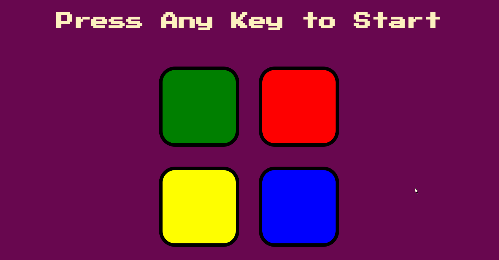

## ⚡Name

Memory Game

## 📝Description

The aim of the game is to match the pattern of the pressed buttons which generate unique sounds. The higher the level, the longer the pattern will be. The game will reset back to level 1 as soon as a wrong button is detected.

## 🛠️Usage

There are 2 codes for the game - one using Javascript, the other using JQuery. You can try one out by **commenting the other one** as shown below.

```python
# Using JQuery
<script src="https://ajax.googleapis.com/ajax/libs/jquery/3.5.1/jquery.min.js"></script>
<script src="jq-solution.js" type="text/javascript"></script>

# Commenting Javascript
<!--<script src="js-solution.js" type="text/javascript"></script>-->
```
```python
# Commenting JQuery
<!--<script src="https://ajax.googleapis.com/ajax/libs/jquery/3.5.1/jquery.min.js"></script>
<script src="jq-solution.js" type="text/javascript"></script>-->

# Using JavaScript 
<script src="js-solution.js" type="text/javascript"></script>

```
## 💻Programming Languages/Libraries

<p>
     <br/>
     <br/>
     <br/>
     
</p>

## 🎮Demo

 <br/>

